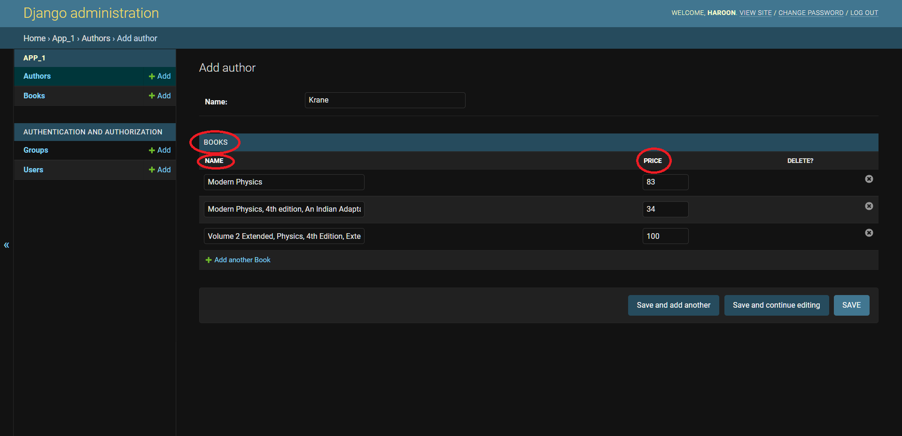
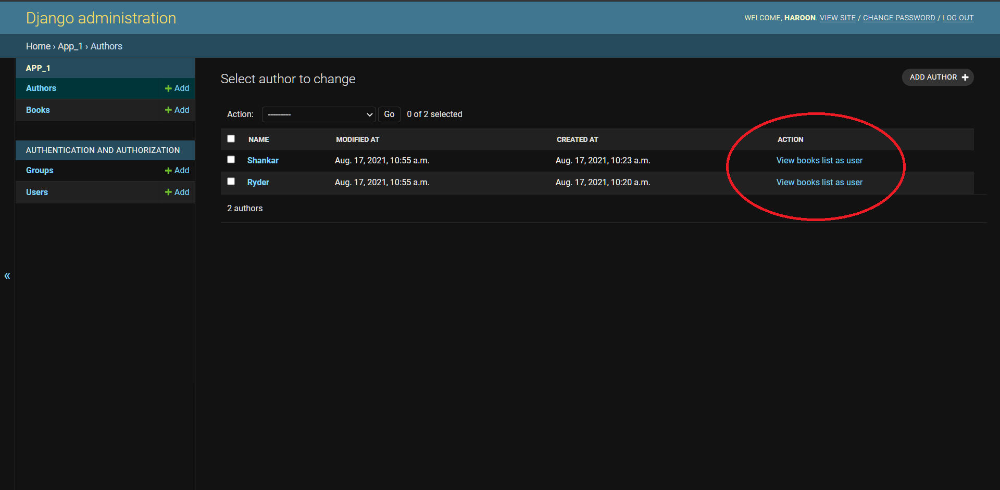
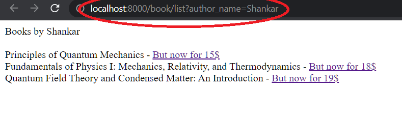

**django-challenge-2**
\
Django Admin is powerful. Can you add some useful features to it?
\
\
This application has two models. Book and Author. You can surely guess what it does.
\
\
This challenge is meant to test your ability to use some of the powerful features that Django Admin has.
\
There are two tasks you should achieve.

* Task 1
When we are adding or editing an author, it is nice to be able to add, delete, and modify books in the same page.

* Task 2
Sometimes, we need custom actions for our models. For example, It is nice to be able to navigate to user's point of view for our authors (not the best possible example though).

By clicking on our custom action, we will be redirected to the author books page as users can see.

Send us a pull request with the features added.
\
\
You need to have these skills to do this task:
- [ ] Django-Admin-Master

* These features are needed in almost all projects.
